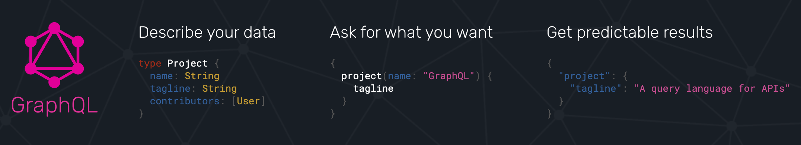

# GraphQL API Automation Test framework



## Requirements:

[](https://nodejs.org/en/download/)
[](https://code.visualstudio.com/download)

## Getting Started:

Clone Repository

```bash
1. git clone https://github.com/sadabnepal/GraphQLTesting.git
2. Navigate to GraphQLTesting
```

Install the dependencies

```bash
npm install
```

API Sources

```ini
https://demo.vendure.io/shop-api [GraphQl]
https://demo.vendure.io/ [web app]
```

Run tests and Generate Report

```bash
npm test  [run all tests]
```

## Key Features:

    - GraphQL API Testing
    - Request and Response log to report
    - Multi environment support using dotenv
    - Supertest, Mocha, TypesScript with mochawesome report

## Folder structure:

```ini
├───.vscode
|    └───settings.json
├───samples
├───test
|    ├───env
|    ├───helper
|    ├───helper
|    ├───payload
|    ├───specs
|    └───types
├───.gitignore
├───package-lock.json
├───package.json
├───README.md
└───tsconfig.json
```

## Sample Report:


