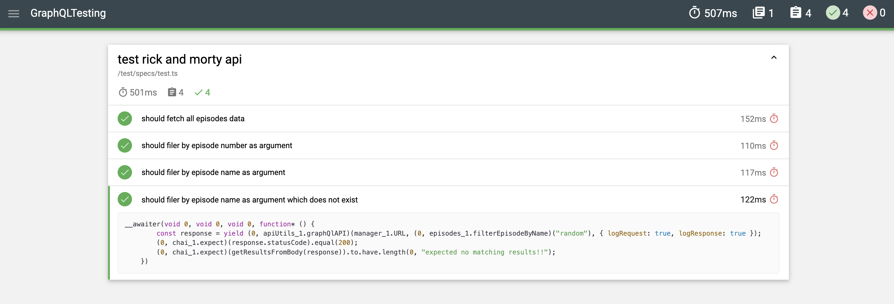

# GrapgQL API Automation Test framework

API Test Automation is mocha framework to perform GraphQL API testing using supertest TypeScript library.

## Requirements:

[](https://nodejs.org/en/download/)
[](https://code.visualstudio.com/download)

## Getting Started:

Clone Repository

```bash
1. git clone https://github.com/sadabnepal/GraphQLTesting.git
2. Navigate to GraphQLTesting
```

Install the dependencies

```bash
npm install
```

API Sources

```ini
https://rickandmortyapi.com/graphql
```

Run tests and Generate Report

```bash
npm test  [run all tests]
```

## Key Features:

    - Mocha framework
    - Supertest library
    - Mochawesome Report
    - GraphQL API Testing
    - Mocha framework to organize tests
    - Multi environment support using dotenv

## Folder structure:

```ini
├───.vscode
|    └───settings.json
├───test
|    ├───env
|    ├───helper
|    ├───helper
|    ├───queries
|    └───specs
├───.gitignore
├───package-lock.json
├───package.json
├───README.md
├───report.png
└───tsconfig.json
```

## Sample Report:

